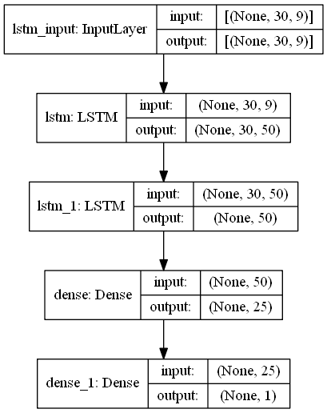

# coin-stock-deep-learning
upbit-api를 통해서 coin 데이터를 받아 LSTM으로 주가 예측

## 개요
본 시스템은 크게 3가지 단계로 이루어져 있습니다.
1. Data pre-processing
upbit-api를 통해서 원하는 코인의 'opening_price', 'high_price', 'low_price', 'trade_price', 'candle_acc_trade_volume'를 가져와 .csv로 저장합니다.
2. Deep learning
데이터를 LSTM을 통해 학습합니다.
3. Predict
학습한 모델을 통해서 하루 뒤의 코인 주가를 예측합니다.

## Installation
파이썬 개발 환경으로 최신 버전의 Anaconda를 설치하세요. (Python3 버전용)
* tensorflow (2 이상)
* pandas
* numpy
* scikit-learn
* matplotlib
* tqdm
* requests

```
$ pip install -r requirements.txt
```

------------
## Directory
필수 디렉토리는 다음과 같습니다:
```
.
├── coin_list.txt
├── upbit_main.py
├── upbit_market.py
├── upbit_deep.py
├── upbit_deep_test.py
├── checkpoint/
└── data/
```

각각의 것들에 대한 개요입니다:

| 파일 | 설명 |
| -------- | ----------- |
| `coin_list.txt` | 원하는 코인이름 입력 |
| `upbit_main.py` | main |
| `upbit_market.py` | coin-stock데이터 받아오기 |
| `upbit_deep.py` | deep learning학습 |
| `upbit_deep_test.py` | 검증 |

시작하기 앞서 coin_list.txt에 원하는 코인의 이름을 **한글명**으로 적어야합니다.
```
비트코인 이더리움
리플 에이다
폴카닷
```

------------
## Run
다음과 같이 프로그램을 실행 합니다.
```
$ python upbit_main.py
```

결과는 아래의 파일과 같이 저장됩니다.
1. coin stock data: (./data/**coin name**.csv)
2. loss: (./**coin name**.png)
3. checkpoint (./checkpoint/**coin name**.ckpt)
4. result (./**coin name**_pred.png)

------------
**1. coin stock data**


**2. loss**


**4. result**


## upbit_market
### 성능
[upbit-api](https://upbit.com/service_center/open_api_guide)를 가지고 200개의 데이터를 한번 받는데 0.1005s가 걸리며 반복문을 통해서 200, 100, 10, 1개순으로 데이터를 받으며 원하는 날짜를 입력하면 그 날부터 데이터를 받습니다.
1일단위는 ["opening_price", "high_price", "low_price", "trade_price", "candle_acc_trade_price", "candle_acc_trade_volume", "prev_closing_price", "change_price", "change_rate"]이며, 그 외에는 ["opening_price", "high_price", "low_price", "trade_price", "candle_acc_trade_price", "candle_acc_trade_volume"]를 받습니다. 자세한 내용은 [upbit-api-docs]](https://docs.upbit.com/reference#%EC%8B%9C%EC%84%B8-%EC%BA%94%EB%93%A4-%EC%A1%B0%ED%9A%8C)를 확인해주세요.

----
KRW-coin의 종목을 korean, english를 dic형태로 반환합니다.
coin_list에는 korean KRW-coin을 리스트형태로 지정해주어야 합니다.
None인 경우 KRW-coin전체를 반환합니다.
```python
upbit_market.Choose_coin(coin_list = None)
```

`local_path` 파라미터는 현재 소스가 저장된 디렉토리로 지정됩니다.
- 래퍼런스 함수로 `os.getcwd()`를 사용하면 됩니다.

`step` 파라미터는 조회단위를 지정합니다. 파라미터에는 다음 값을 지정할 수 있습니다.
- `day`/`minute1`/`minute3`/`minute5`/`minute10`/`minute15`/`minute30`/`minute60`/`minute240`/`week`/`month`

`coin_list` 파라미터는 원하는 코인의 이름을 리스트형태로 적어주면 됩니다.

```python
upbit_market.get_coin_data(local_path = None, step = None, coin_list = None):
```


## upbit_deep
### Model



LSTM기반으로 사용하며 <span style="color:red">현재는 더 좋은 모델을 찾고 있습니다.

'opening_price', 'high_price', 'low_price', 'trade_price', 'candle_acc_trade_volume' 총 (60, 5)의 데이터를 통해서 다음 step의 trade_price를 예측하는 모델입니다
  - Train : Test = 70 : 30
  - Train Period = 현재로부터 최근 30% 데이터
  - epochs = 20 (2번부터 loss가 줄지 않을 때 정지합니다.)
  